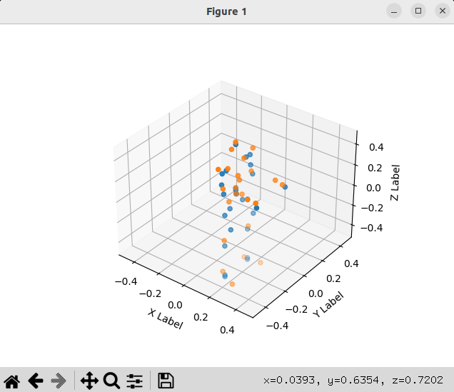
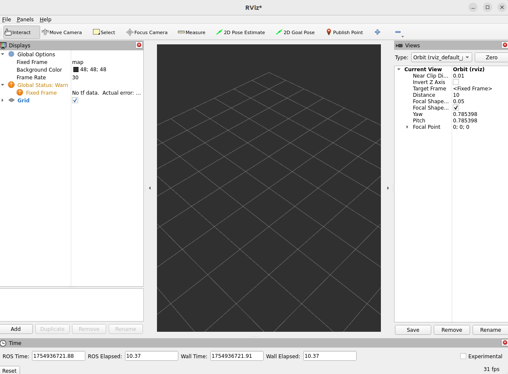
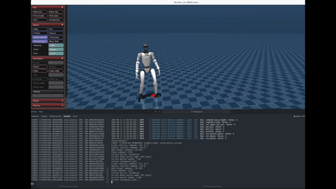
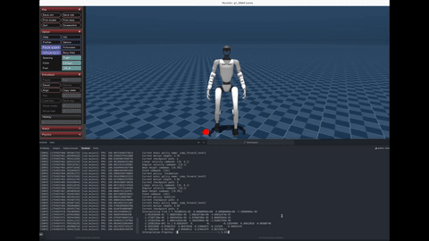
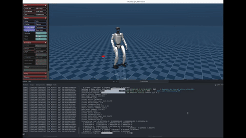
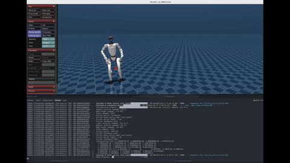
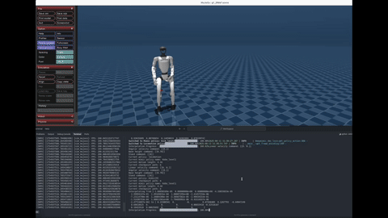
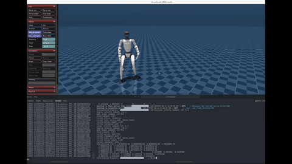

<h1 align="center"> ASAP: Aligning Simulation and Real-World Physics for 

Learning Agile Humanoid Whole-Body Skills </h1>

<div align="center">

Robotics: Science and Systems (RSS) 2025

[[Website]](https://agile.human2humanoid.com/)
[[Arxiv]](https://arxiv.org/pdf/2502.01143)
[[Video]](https://www.youtube.com/watch?v=tu7LSNYWDTs&ab_channel=LeCARLabatCMU)

<p align="center">
     &nbsp; &nbsp; &nbsp; &nbsp; &nbsp; &nbsp; &nbsp; &nbsp; &nbsp; &nbsp;
</p>


[](https://developer.nvidia.com/isaac-gym) [](https://docs.isaacsim.omniverse.nvidia.com/4.2.0/index.html) [](https://docs.isaacsim.omniverse.nvidia.com/4.2.0/index.html) [](https://ubuntu.com/blog/tag/22-04-lts) []()


</div>

<!-- # Table of Contents -->
## 📚 Table of Contents

1. **[Overview](#overview)**  
   - Links: [Website](https://agile.human2humanoid.com/) • [Arxiv](https://arxiv.org/pdf/2502.01143) • [Video](https://www.youtube.com/watch?v=tu7LSNYWDTs&ab_channel=LeCARLabatCMU)  
 

2. **[Installation & Setup](#installation)**  
   2.1 [Base Frameworks](#isaacgym-conda-env)  
   2.2 [IsaacGym Setup](#install-isaacgym)  
   2.3 [HumanoidVerse Setup](#install-humanoidverse)  
   2.4 [IsaacSim + IsaacLab Setup](#isaaclab-environment)  
   2.5 [Genesis Environment Setup](#genesis-environment)  

3. **[Training Pipelines](#motion-tracking-training)**  
   3.1 [Phase-Based Motion Tracking](#motion-tracking-training)  
   3.2 [ASAP Delta Action Model](#asap-delta-action-model-training)  
       - [Train Delta Action Model](#train-delta-action-model)  
       - [Finetune Policy with Delta Action Model](#use-delta-action-model-for-policy-finetuning)  

4. **[Motion Retargeting to Any Humanoid](#motion-retargeting-to-any-humanoid)**  
   4.1 [Step 1: SMPL Shape Preparation](#1-smpl-shape-preparation)  
   4.2 [Step 2: SMPL Motion Preparation (AMASS)](#2-smpl-motion-preparation-amass)  
   4.3 [Step 3: Robot XML & Motion Config](#3-robot-xml-and-motion-config-preparation)  
   4.4 [Step 4: Humanoid-SMPL Shape Fitting](#4-humanoid-smpl-shape-fitting)  
   4.5 [Step 5: Humanoid-SMPL Motion Retargeting](#5-humanoid-smpl-motion-retargeting)  

5. **[Deployment: Sim2Sim & Sim2Real](#sim2simsim2real)**  
   5.1 [Environment Setup](#environment-setup)  
   5.2 [Sim2Sim Deployment](#sim2sim)  
   5.3 [Sim2Real Deployment](#sim2real)  

7. **[Citation](#citation)**  

8. **[License](#license)**


## TODO
- [x] Release code backbone
- [x] Release phase-based motion tracking training pipeline
- [x] Release ASAP motion datasets
- [x] Release motion retargeting pipeline
- [x] Release sim2sim in MuJoCo
- [x] Release sim2real with UnitreeSDK
- [x] Release ASAP delta action model training pipeline


# Installation

ASAP codebase is built on top of [HumanoidVerse](https://github.com/LeCAR-Lab/HumanoidVerse) (a multi-simulator framework for humanoid learning) and [Human2Humanoid](https://github.com/LeCAR-Lab/human2humanoid) (our prior work on humanoid whole-body tracking).

[HumanoidVerse](https://github.com/LeCAR-Lab/HumanoidVerse) allows you to train humanoid skills in multiple simulators, including IsaacGym, IsaacSim, and Genesis. Its key design logic is the separation and modularization of simulators, tasks, and algorithms, which enables smooth transfers between different simulators and the real world with minimum effort (just one line of code change). We leverage this framework to develop [ASAP](https://agile.human2humanoid.com/) and study how to best transfer policies across simulators and the real world.

## IsaacGym Conda Env

Create mamba/conda environment, in the following we use conda for example, but you can use mamba as well.

```bash
conda create -n hvgym python=3.8
conda activate hvgym
```
### Install IsaacGym

Download [IsaacGym](https://developer.nvidia.com/isaac-gym/download) and extract:

```bash
wget https://developer.nvidia.com/isaac-gym-preview-4
tar -xvzf isaac-gym-preview-4
```

Install IsaacGym Python API:

```bash
pip install -e isaacgym/python
```

Test installation:

```bash
python 1080_balls_of_solitude.py  # or
python joint_monkey.py
```

For libpython error:

- Check conda path:
    ```bash
    conda info -e
    ```
- Set LD_LIBRARY_PATH:
    ```bash
    export LD_LIBRARY_PATH=</path/to/conda/envs/your_env/lib>:$LD_LIBRARY_PATH
    ```

### Install HumanoidVerse

Install dependencies:
```bash
pip install -e .
pip install -e isaac_utils
pip install -r requirements.txt
```

Test with:
```bash
HYDRA_FULL_ERROR=1 python humanoidverse/train_agent.py \
+simulator=isaacgym \
+exp=locomotion \
+domain_rand=NO_domain_rand \
+rewards=loco/reward_g1_locomotion \
+robot=g1/g1_29dof_anneal_23dof \
+terrain=terrain_locomotion_plane \
+obs=loco/leggedloco_obs_singlestep_withlinvel \
num_envs=1 \
project_name=TestIsaacGymInstallation \
experiment_name=G123dof_loco \
headless=False
```
<details>
<summary>Note:</summary>
This is ONLY for testing, NOT how we train the locomotion policy in the ASAP paper. But still, you can train a locomotion policy by:

```bash
HYDRA_FULL_ERROR=1 python humanoidverse/train_agent.py \
+simulator=isaacgym \
+exp=locomotion \
+domain_rand=NO_domain_rand \
+rewards=loco/reward_g1_locomotion \
+robot=g1/g1_29dof_anneal_23dof \
+terrain=terrain_locomotion_plane \
+obs=loco/leggedloco_obs_singlestep_withlinvel \
num_envs=4096 \
project_name=TestIsaacGymInstallation \
experiment_name=G123dof_loco \
headless=True \
rewards.reward_penalty_curriculum=True \
rewards.reward_initial_penalty_scale=0.1 \
rewards.reward_penalty_degree=0.00003 
```

</details>

## IsaacLab Environment

### Install IsaacSim
1. Download Omniverse Launcher
2. Install Isaac Sim through launcher
3. Set environment variables:
```bash
export ISAACSIM_PATH="${HOME}/.local/share/ov/pkg/isaac-sim-4.2.0"
export ISAACSIM_PYTHON_EXE="${ISAACSIM_PATH}/python.sh"
```

### Install IsaacLab
```bash
git clone https://github.com/isaac-sim/IsaacLab.git
cd IsaacLab && ./isaaclab.sh --conda hvlab
mamba activate hvlab
sudo apt install cmake build-essential
./isaaclab.sh --install
```

### Setup HumanoidVerse
```bash
pip install -e .
pip install -e isaac_utils
```

## Genesis Environment
```bash
mamba create -n hvgen python=3.10
mamba activate hvgen
pip install genesis-world torch
```
Install dependencies:

```bash
pip install -e .
pip install -e isaac_utils
```


# Motion Tracking Training

Train a phase-based motion tracking policy to imitate Cristiano Ronaldo's signature Siuuu move

```bash
python humanoidverse/train_agent.py \
+simulator=isaacgym \
+exp=motion_tracking \
+domain_rand=NO_domain_rand \
+rewards=motion_tracking/reward_motion_tracking_dm_2real \
+robot=g1/g1_29dof_anneal_23dof \
+terrain=terrain_locomotion_plane \
+obs=motion_tracking/deepmimic_a2c_nolinvel_LARGEnoise_history \
num_envs=4096 \
project_name=MotionTracking \
experiment_name=MotionTracking_CR7 \
robot.motion.motion_file="humanoidverse/data/motions/g1_29dof_anneal_23dof/TairanTestbed/singles/0-TairanTestbed_TairanTestbed_CR7_video_CR7_level1_filter_amass.pkl" \
rewards.reward_penalty_curriculum=True \
rewards.reward_penalty_degree=0.00001 \
env.config.resample_motion_when_training=False \
env.config.termination.terminate_when_motion_far=True \
env.config.termination_curriculum.terminate_when_motion_far_curriculum=True \
env.config.termination_curriculum.terminate_when_motion_far_threshold_min=0.3 \
env.config.termination_curriculum.terminate_when_motion_far_curriculum_degree=0.000025 \
robot.asset.self_collisions=0
```

After training, you can visualize the policy by:
```bash
python humanoidverse/eval_agent.py \
+checkpoint=logs/MotionTracking/xxxxxxxx_xxxxxxx-MotionTracking_CR7-motion_tracking-g1_29dof_anneal_23dof/model_5800.pt
```

This is the visualization of the policy after traning 5800 iters. The policy is able to imitate the motion of Cristiano Ronaldo's Siuuu move. With more training, the policy will be more accurate and smooth (see the video in the [paper](https://arxiv.org/pdf/2502.01143)).


# ASAP delta action model training

Note that the only difference between the delta action model training and naive motion tracking training is that delta action model needs a motion file with extra keyname `"action"` in the motion file, so that the resulting RL policy we are training is able to use the delta action model to `"control the robot"` to match the real-world/sim2sim motions.


## Train delta action model

```
python humanoidverse/train_agent.py \                                                                                   
  +simulator=isaacgym \
  +exp=train_delta_a_open_loop \
  +domain_rand=NO_domain_rand \
  +rewards=motion_tracking/delta_a/reward_delta_a_openloop \
  +robot=g1/g1_29dof_anneal_23dof \
  +terrain=terrain_locomotion_plane \
  +obs=delta_a/open_loop \
  num_envs=5000 \
  project_name=DeltaA_Training \
  experiment_name=openloopDeltaA_training \
  robot.motion.motion_file="<PATH_TO_YOUR_MOTION_FILE_WITH_ACTION_KEYNAME>" \
  env.config.max_episode_length_s=1.0 \
  rewards.reward_scales.penalty_minimal_action_norm=-0.1 \
  +device=cuda:0 \
  env.config.resample_motion_when_training=True \
  env.config.resample_time_interval_s=10000
```

## Use delta action model for policy finetuning


```
HYDRA_FULL_ERROR=1 \
python humanoidverse/train_agent.py \
+simulator=isaacgym \
+exp=train_delta_a_closed_loop \
algo.config.policy_checkpoint='<PATH_TO_YOUR_DELTA_A_MODEL>' \
+domain_rand=NO_domain_rand_finetune_with_deltaA \
+rewards=motion_tracking/reward_motion_tracking_dm_simfinetuning \
+robot=g1/g1_29dof_anneal_23dof \
+terrain=terrain_locomotion_plane \
+obs=delta_a/train_policy_with_delta_a \
num_envs=4096 \
project_name=DeltaA_Finetune \
experiment_name=finetune_with_deltaA \
robot.motion.motion_file="<PATH_TO_YOUR_MOTION_FILE>" \
+opt=wandb \
env.config.add_extra_action=True \
+checkpoint="<PATH_TO_YOUR_POLICY_TO_BE_FINETUNED>" \
domain_rand.push_robots=False \
env.config.noise_to_initial_level=1 \
rewards.reward_penalty_curriculum=True \
+device=cuda:0 \
algo.config.save_interval=5 \
algo.config.num_learning_iterations=1000 

```


# Motion Retargeting to Any Humanoid

> [!IMPORTANT]
> Here we share a generic humanoid motion retargeting pipeline to any humanoid from [PHC](https://github.com/ZhengyiLuo/PHC). 

> [!IMPORTANT]
> We have provided all the SMPL motions (`ASAP/humanoidverse/data/motions/raw_tairantestbed_smpl`) and retargtted G1 motions (`ASAP/humanoidverse/data/motions/g1_29dof_anneal_23dof/TairanTestbed/singles`) used in the ASAP paper in this codebase. If you are interested in using these motions G1, you can ignore this section. If you are interested in retargeting other humanoids or other motions, you can follow the steps below to prepare the SMPL shapes and motions.


It has three steps:
1. SMPL Shape preparation
2. SMPL Motion preparation
3. Robot XML and Motion Config preparation
4. Humanoid-SMPL shape fitting
5. Humanoid-SMPL motion retargeting

## 1. SMPL Shape preparation

Download [v1.1.0 SMPL files with pkl format](https://download.is.tue.mpg.de/download.php?domain=smpl&sfile=SMPL_python_v.1.1.0.zip) and put it under `humanoidverse/data/smpl/`, and you should have:

```
|-- ASAP
    |-- humanoidverse
        |-- data
            |-- smpl
                |-- SMPL_python_v.1.1.0.zip
```

Then `cd ASAP/humanoidverse/data/smpl/` and  `unzip SMPL_python_v.1.1.0.zip`, after some copying and moving, you should have:

```
|-- ASAP
    |-- humanoidverse
        |-- data
            |-- smpl
                |-- SMPL_python_v.1.1.0
                |-- models
                    |-- basicmodel_f_lbs_10_207_0_v1.1.0.pkl
                    |-- basicmodel_m_lbs_10_207_0_v1.1.0.pkl
                    |-- basicmodel_neutral_lbs_10_207_0_v1.1.0.pkl
                |-- smpl_webuser
                |-- ...

```

Rename these three pkl files and move it under smpl like this:

```
|-- ASAP
    |-- humanoidverse
        |-- data
            |-- smpl
                |-- SMPL_FEMALE.pkl
                |-- SMPL_MALE.pkl
                |-- SMPL_NEUTRAL.pkl
```


## 2. SMPL Motion preparation (AMASS)
Download [AMASS Dataset](https://amass.is.tue.mpg.de/index.html) with `SMPL + H G format` and put it under `humanoidverse/data/motions/AMASS/AMASS_Complete/`.

```
|-- ASAP
    |-- humanoidverse
        |-- data
            |-- AMASS
                |-- AMASS_Complete
                    |-- ACCAD.tar.bz2
                    |-- BMLhandball.tar.bz2
                    |-- BMLmovi.tar.bz2
                    |-- BMLrub.tar
                    |-- CMU.tar.bz2
                    |-- ...
                    |-- Transitions.tar.bz2
```

And then cd ASAP/humanoidverse/data/motions/AMASS/AMASS_Complete/ and extract all the motion files by running:

```bash
for file in *.tar.bz2; do
    tar -xvjf "$file"
done
```
Then you should have:

```
|-- ASAP
    |-- humanoidverse
        |-- data
            |-- AMASS
                |-- AMASS_Complete
                    |-- ACCAD
                    |-- BioMotionLab_NTroje
                    |-- BMLhandball
                    |-- BMLmovi
                    |-- CMU
                    |-- ...
                    |-- Transitions
```

## 3. Robot XML and Motion Config preparation

Make sure you have robot xml and meshes ready at (G1 as example) `humanoidverse/data/robots/g1/g1_29dof_anneal_23dof_fitmotionONLY.xml`
And add your config for the robot motion in `humanoidverse/config/robot/g1_29dof_anneal_23dof.yaml` with like the following. Remember to link the xml path in the config.


## 4. Humanoid-SMPL shape fitting
Run the following command to fit the SMPL shape to the humanoid.
```bash
python scripts/data_process/fit_smpl_shape.py +robot=g1/g1_29dof_anneal_23dof
```
And you should have you shape file located at `humanoidverse/data/shape/g1_29dof_anneal_23dof/shape_optimized_v1.pkl`

If you want to visualize the shape, you can run with flag `+vis=True`, then you can have visualization of the fitted SMPL body shape and the humanoid body keypoints like this shape. The blue is the humanoid body keypoints and the orange is the fitted SMPL body keypoint. You can tune the `robot motion` in `humanoidverse/config/robot/g1_29dof_anneal_23dof.yaml` to adjust the correspondence, extend links lengths to get better fitted SMPL shape.



## 5. Humanoid-SMPL motion retargeting
Run the following command to retarget the motion to the humanoid.
```bash
python scripts/data_process/fit_smpl_motion.py +robot=g1/g1_29dof_anneal_23dof
```

### Visualize motion
Run
```bash
python scripts/vis/vis_q_mj.py +robot=g1/g1_29dof_anneal_23dof +visualize_motion_file="humanoidverse/data/motions/g1_29dof_anneal_23dof/TairanTestbed/singles/0-motions_raw_tairantestbed_smpl_video_side_jump_level4_filter_amass.pkl"
```

To test, and you should have you one single motion file located at `humanoidverse/data/motions/g1_29dof_anneal_23dof/TairanTestbed/singles/0-motions_raw_tairantestbed_smpl_video_side_jump_level4_filter_amass.pkl`.

If you want to visualize the motion, you can run
```bash
python scripts/vis/vis_q_mj.py +robot=g1/g1_29dof_anneal_23dof +visualize_motion_file="humanoidverse/data/motions/g1_29dof_anneal_23dof/TairanTestbed/singles/0-motions_raw_tairantestbed_smpl_video_side_jump_level4_filter_amass.pkl"
```
You should have


# Sim2Sim/Sim2Real

## Environment Setup

Env Installation:
```
mamba create -n asap_deploy python=3.10
mamba activate asap_deploy
```


Install ros2-python

```bash
# this adds the conda-forge channel to the new created environment configuration 
conda config --env --add channels conda-forge
# and the robostack channel
conda config --env --add channels robostack-staging
# remove the defaults channel just in case, this might return an error if it is not in the list which is ok
conda config --env --remove channels defaults
# install the ros2-python package
conda install ros-humble-desktop
```

Test Ros2Installation:

```bash
rviz2
```

You should see the UI like this:




Install Unitree SDK

```bash
git clone git@github.com:unitreerobotics/unitree_sdk2_python.git
cd unitree_sdk2_python
pip install -e .
```

minor issue to fix:

```bash
pip install --upgrade numpy scipy
```

## Sim2Sim


start the simulation in the sim2real folder:
```bash
python sim_env/base_sim.py --config=config/g1_29dof_hist.yaml
```

in another terminal, start the policy:
```bash
python rl_policy/deepmimic_dec_loco_height.py --config=config/g1_29dof_hist.yaml --loco_model_path=./models/dec_loco/20250109_231507-noDR_rand_history_loco_stand_height_noise-decoupled_locomotion-g1_29dof/model_6600.onnx --mimic_model_paths=./models/mimic
```

- click to the policy terminal and press `]` to activate the locomotion policy
- click to the policy terminal and press `[` to activate the asap policy (phase-based motion tracking policy)
- click to the policy terminal and press `;` to switch to the asap policy 
- press `i` to make the robot the initial position
- press `o` to emergence stop the robot
- press `9` in mujoco viewer to release the robostack
- press `=` to switch between tapping and walking for the locomotion policy
- press `w/a/s/d` to control the linear velocity
- press `q/e` to control the angular velocity
- press `z` to set all commands to zero


And you should be able to play around with some checkpoints from the ASAP paper. Have fun!

<table>
  <tr>
    <td></td>
    <td></td>
    <td></td>
  </tr>
  <tr>
    <td></td>
    <td></td>
    <td></td>
  </tr>
</table>
<!-- Replace gif1.gif ... gif6.gif with your actual gif filenames and optionally add captions below each if desired -->


## Sim2Real

`Note from Tairan`: make sure to make the G1 robot to 29dof following this [doc](https://support.unitree.com/home/en/G1_developer/waist_fastener) and restart the robot after waist unlocking. If you don't know how to log into the Unitree Explore APP, contact unitree support.

Enter Low-Level for g1
- Open humanoid and wait until the head blue light is constantly on
- `L2+R2`
- `L2+A`
- `L2+B`
- Connect PC to the G1 by ethernet cable and configure the network following [this document](https://support.unitree.com/home/en/G1_developer/quick_development) 

Before starting the policy, modify the `config/g1_29dof_hist.yaml` to set `INTERFACE` to `eth0` (if you are using linux), basically the network interface that you are using to connect to the robot with your PC's IP shown as `192.168.123.xxx` in `ifconfig`.

start the policy:
```bash
python rl_policy/deepmimic_dec_loco_height.py --config=config/g1_29dof_hist.yaml --loco_model_path=./models/dec_loco/20250109_231507-noDR_rand_history_loco_stand_height_noise-decoupled_locomotion-g1_29dof/model_6600.onnx --mimic_model_paths=./models/mimic
```


- click to the policy terminal and press `]` to activate the locomotion policy
- click to the policy terminal and press `[` to activate the asap policy (phase-based motion tracking policy)
- click to the policy terminal and press `;` to switch to the asap policy 
- press `i` to make the robot the initial position
- press `o` to emergence stop the robot
- press `9` in mujoco viewer to release the robostack
- press `=` to switch between tapping and walking for the locomotion policy
- press `w/a/s/d` to control the linear velocity
- press `q/e` to control the angular velocity
- press `z` to set all commands to zero
- press `o` to emergence stop the robot


### ‼️Alert & Disclaimer
Deploying these models on physical hardware can be hazardous. Unless you have deep sim‑to‑real expertise and robust safety protocols, we strongly advise against running the model on real robots. These models are supplied for research use only, and we disclaim all responsibility for any harm, loss, or malfunction arising from their deployment.


### Demo code to collect real-world data
We provide a demo code to collect real-world data in the `sim2real/rl_policy/listener_deltaa.py` file. Since MoCap setup is hard to transfer across different robots/labs, we hope this code can help you to collect data for your own experiments. Contact us (tairanh@andrew.cmu.edu) if you have any questions.


# Citation
If you find our work useful, please consider citing us!

```bibtex
@article{he2025asap,
  title={ASAP: Aligning Simulation and Real-World Physics for Learning Agile Humanoid Whole-Body Skills},
  author={He, Tairan and Gao, Jiawei and Xiao, Wenli and Zhang, Yuanhang and Wang, Zi and Wang, Jiashun and Luo, Zhengyi and He, Guanqi and Sobanbabu, Nikhil and Pan, Chaoyi and Yi, Zeji and Qu, Guannan and Kitani, Kris and Hodgins, Jessica and Fan, Linxi "Jim" and Zhu, Yuke and Liu, Changliu and Shi, Guanya},
  journal={arXiv preprint arXiv:2502.01143},
  year={2025}
}
```

# License

This project is licensed under the MIT License - see the [LICENSE](LICENSE) file for details.
